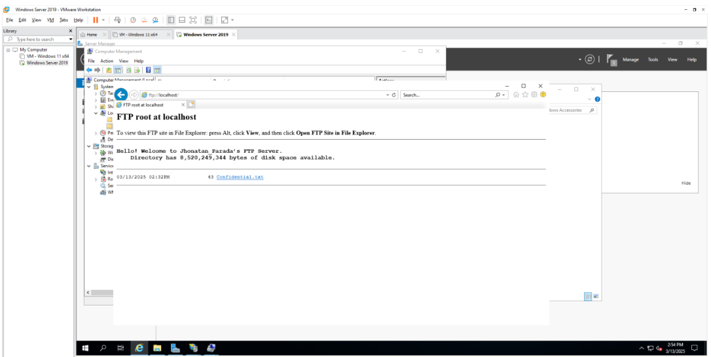
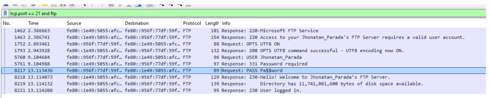

# FTP Server Configuration and Network Traffic Analysis

Configuring an FTP server and analyzing network traffic
Using Windows Server 2019 and Wireshark, this project covers the full deployment and security evaluation of an FTP server.

## Instruments Role of Used Windows Server 2019 IIS FTP Server
Internet Explorer (for FTP access) and Wireshark CMD/PowerShell

## Lab Synopsis
### Section 1: Configuring an FTP Server
- installed Windows Server's FTP and IIS roles.
- Made a Security Lab FTP site that points to a unique directory.
- Configured exit, welcome, and FTP banner messages.
- Used Computer Management to create users and control permissions.
- Used Internet Explorer to confirm file access and authentication.

### Section 2: Analysis and Capture of Traffic
FTP traffic was monitored using Wireshark, and the following was extracted:
- Content of the transferred file (Confidential.txt) and plaintext login credentials (PASS keyword)
- Using packet inspection, clear-text vulnerabilities in FTP were found.
- Fixed a firewall configuration problem that was preventing FTP file transfers.

## Screenshots

## Important Security Discoveries
- Without encryption, FTP credentials are accessible in plaintext.
- Packet analysis can be used to read TCP payloads from FTP file transfers.
- Even when authentication is successful, misconfigured firewalls can silently block transfers.

## Knowledge Acquired
- Because FTP isn't encrypted, you should never use it for sensitive data. Even if a control connection is successful, firewalls can still impact FTP data transfer.
- A useful tool for comprehending low-level network behavior is Wireshark.
